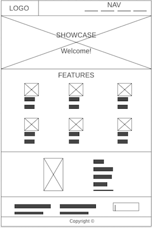
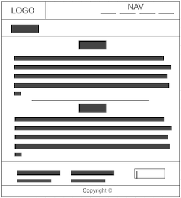
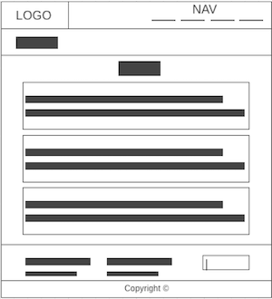
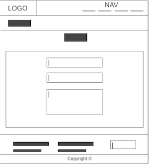

# Development Strategy

> `App-theme`

- This project is a simple little website developing with git branches, incremental-development and imitation collaborating (developed by one person)
- This project would interest for novice students of web-development because there is example of applying git branches, incremental-development and collaborating workflow.

## Wireframes

#### Home page
  
#### About page
  
#### Services page
  
#### Contact page
  

## 0. Set-Up

__A User can see my initial repository and live demo__

### Repo

- Generate from Template
- Write initial, basic README
- Turn on GitHub Pages

## 1. Header

### Branches

- This user story was developed on a brach called `1-header`
- It was pushed to github in new original branch when the feature was finished.
- It was merged to master by pull request and closing issue #1.

### HTML

> This site-block is displayed on each pages. It is the first what see site-visitor. This block should be simple, attractive, understandable and tell to site-visitor where he is and what he could find.

Add title and links for style-css.  
Add header with name of company and navigation in the right-side of header.  
Use minimum text.

### CSS

Use mono color for background of header.   
Use contrast color of font.  
Use hover for navigation.

---
---

## 2. Showcase

### Branches

- This user story was developed on a brach called `2-showcase`
- It was pushed to github in new original branch when the feature was finished.
- It was merged to master by pull request and closing issue #3.

### HTML

> This site-block is displayed only on Home-page with aim attract attention, decorate site and reveal the product which company offers and his advantages . These advantages must be understandable and remembered.

Add section with Welcome-prase and short nice introduction.
Add 6 section with 6 type of advantages of product.  
Each section consist of logo-img, head and short paragraph.

### CSS

- Add simple foto as background for showcase relevant company activities.
- Add special box for welcome-prase and short introduction.
- Tune contrast font. 
- Use colorful outline images as logo-img of advantages.

---
---

## 3. Infosection

### Branches

- This user story was developed on a brach called `3-infosection`
- It was pushed to github in new original branch when the feature was finished.
- It was merged to master by pull request and closing issue #5.

### HTML

> This site-block consist of two parts. First part is displayed only on Home-page and presented product company. Second part is displayed on each pages and contains contacts of company, form for sign up and short information about.   
> Site-visitor expects from this site-block visual description about product and his advantages and different ways to learn more about product: phone number, e-mail, subscription etc.  

- Add section with list of benefits
- Add section with phone-number, e-mail and address
- Add section with small text About us
- Add form for newsletter

### CSS

- Add foto how app looks like
- Use contrast font
- Use mono color for background 

---
---

## 4. Footer

### Branches

- This user story was developed on a brach called `4-footer`
- It was pushed to github in new original branch when the feature was finished.
- It was merged to master by pull request and closing issue #7.

### HTML

> This site-block is displayed on each pages. It is needed for confirmation that all information on site owned by company.

Add paragraph about owner of site and copyright.  
Add the year of creation of the site.  

### CSS

Use contrast font.  
Use a little font.  
Use mono color of background in harmony with the overall color scheme.   

---
---

## 5. About

### Branches

- This user story was developed on a brach called `5-about`
- It was pushed to github in new original branch when the feature was finished.
- It was merged to master by pull request and closing issue #9.

### HTML

> This branch about the second page of site which call About Us. On this page site-visitor expect to see some information about company and what she do. This page should be part of overall site.

- Create about.html.   
- Add html tags, title About and link to css file.  
- Copy-paste header, one part of infosection and footer from index.html.  
- Add section Main with some nice information about company (Who we are, What we do).     

### CSS

- Make highlight headers.
- Use contrast background.

---
---

## 6. Services

### Branches

- This user story was developed on a brach called `6-services`
- It was pushed to github in new original branch when the feature was finished.
- It was merged to master by pull request and closing issue #11.

### HTML

> This branch about the third page of site which call Services. On this page site-visitor expect to see all services of company with descriptions. This page should be part of overall site.

- Create services.html.     
- Add html tags, title Services and link to css file.  
- Copy-paste header, one part of infosection and footer from index.html.  
- Add section Main with list of 3 services: head and description for each.      

### CSS

- Make highlight background color for each services in list.
- Use contrast background.  

---
---

## 7. Contact

__full user story description__

### Repo

what branch(es) did you work on?

### HTML

what did you change in the HTML and why?

### CSS

what did you change in the CSS and why?

---
---

## 8. Media queries

__full user story description__

### Repo

what branch(es) did you work on?

### HTML

what did you change in the HTML and why?

### CSS

what did you change in the CSS and why?

----
----

## Finishing Touches

- Write final, complete README
- Validate code to check for any last mistakes
